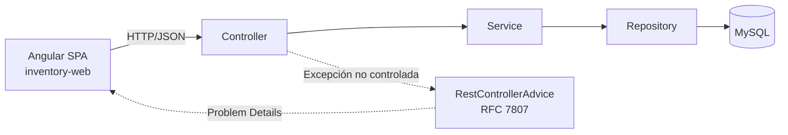

# 📦 Enterprise Inventory Management System


Sistema full-stack desacoplado para la gestión integral de inventarios y catálogo de productos, diseñado bajo patrones arquitectónicos empresariales, inmutabilidad, manejo robusto de excepciones conforme al estándar **RFC 7807 (Problem Details)** y pruebas unitarias aisladas.

---

## 🖼️ Vista Previa

| Listado de productos | Agregar producto | Editar producto |
|---|---|---|
| [Listado](/docs/screenshots/listado-productos.png) | [Agregar](/docs/screenshots/agregar-producto.png) | [Editar](/docs/screenshots/editar-producto.png) | 

---

## 🏗️ Arquitectura y Decisiones de Diseño

El sistema está estructurado como un **monorepo** que separa estrictamente la capa de cliente de la API backend:

```
inventory-system/
├── inventory-api/       # Backend RESTful (Spring Boot 3 + Java 21)
└── inventory-web/       # Frontend SPA (Angular Standalone & Signals)
```

### Diagrama de flujo



### Backend (`inventory-api`)

- **Arquitectura multicapa:** separación estricta de responsabilidades en capas `Controller → Service (interfaz e implementación) → Repository → Entity`.
- **Inmutabilidad y DTOs:** uso de *Java Records* para la transferencia de errores y respuestas desacopladas.
- **Control de excepciones desacoplado:** excepciones de dominio no verificadas (`RecursoNoEncontradoExcepcion`) gestionadas centralizadamente mediante un interceptor global `@RestControllerAdvice`.
- **Integridad y validación de entrada:** aplicación de *Jakarta Bean Validation* (`@Valid`, `@NotBlank`, `@DecimalMin`, `@Min`) en el punto de entrada para evitar la persistencia de estados no válidos.
- **Pruebas unitarias aisladas:** cobertura de la lógica de negocio en `ProductoService` mediante JUnit 5 y dobles de prueba con Mockito, garantizando ejecución rápida e independiente de la base de datos.

### Frontend (`inventory-web`)

- **Componentes autónomos (Standalone Components):** eliminación de `NgModules` en favor de una arquitectura modular basada en dependencias directas.
- **Reactividad con Signals:** manejo de estado sincrónico y asincrónico mediante `signal()`, reduciendo sobrecargas de ciclo de vida.
- **Consumo REST desacoplado:** centralización de llamadas HTTP en un servicio Angular inyectable (`ProductoService`) con tipado estricto.

---

## 🛠️ Stack Tecnológico

| Categoría              | Tecnología                                                   |
|-------------------------|--------------------------------------------------------------|
| Backend                | Java 21 (LTS) & Spring Boot 3.3.x (Spring WebMVC, Spring Data JPA) |
| Persistencia           | MySQL / Hibernate (MySQL Connector/J)                         |
| Validación             | Jakarta Bean Validation (Hibernate Validator)                 |
| Testing Backend        | JUnit 5 & Mockito (`@ExtendWith(MockitoExtension.class)`)      |
| Frontend               | Angular 22 (Signals, Standalone Components, Control Flow `@for`) |
| Lenguaje Frontend      | TypeScript 5.x                                                |
| Estilos                | Bootstrap / CSS3 (diseño responsivo)                          |
| Herramientas Frontend  | Angular CLI 22.0.6, Node.js 22.23.1, npm 12.1.0                |

---

## 🔌 Especificación de la API REST

**Ruta base:** `http://localhost:8080/inventory-app/productos`

| Método   | Endpoint                              | Descripción                     | Body requerido     | Código de éxito | Errores posibles              |
|----------|----------------------------------------|----------------------------------|---------------------|------------------|--------------------------------|
| `GET`    | `/inventory-app/productos`             | Obtener el catálogo completo     | Ninguno             | `200 OK`         | `500 Internal Error`           |
| `GET`    | `/inventory-app/productos/{id}`        | Buscar producto por ID           | Ninguno             | `200 OK`         | `404 Not Found`                |
| `POST`   | `/inventory-app/productos`             | Registrar nuevo producto         | Producto (JSON)     | `201 Created`    | `400 Bad Request`              |
| `PUT`    | `/inventory-app/productos/{id}`        | Actualizar producto existente    | Producto (JSON)     | `200 OK`         | `400 Bad Request`, `404 Not Found` |
| `DELETE` | `/inventory-app/productos/{id}`        | Eliminar producto por ID         | Ninguno             | `204 No Content` | `404 Not Found`                |

### Esquema de error estándar (RFC 7807)

Ante excepciones de negocio o validaciones fallidas, la API responde con una estructura predecible:

```json
{
  "timestamp": "2026-09-27T22:00:00.000",
  "status": 400,
  "error": "Bad Request",
  "mensaje": "Error en las validaciones de los campos",
  "ruta": "/inventory-app/productos",
  "validaciones": {
    "precio": "El precio debe ser superior a 0",
    "descripcion": "La descripción no puede estar vacía"
  }
}
```

---

## 🔐 Configuración de CORS

El backend permite peticiones desde el frontend Angular (`http://localhost:4200`) mediante:

```java
@CrossOrigin(origins = "http://localhost:4200")
```

> ⚠️ En producción, sustituye el origen fijo por la URL real del dominio desplegado (y considera centralizarlo en un `WebMvcConfigurer` si el número de endpoints crece).

---

## 🚀 Puesta en Marcha en Entorno Local

### Prerrequisitos

- JDK 21 configurado en el `PATH` del sistema.
- Node.js v22+ y npm (probado con Node.js 22.23.1 / npm 12.1.0).
- Angular CLI instalado globalmente: `npm install -g @angular/cli` (probado con la v22.0.6).
- Servidor MySQL o MariaDB en ejecución (puerto `3306`).

### 1. Configuración de la base de datos

Crea la base de datos en MySQL:

```sql
CREATE DATABASE IF NOT EXISTS inventory_db CHARACTER SET utf8mb4 COLLATE utf8mb4_unicode_ci;
```

Verifica la conexión en `inventory-api/src/main/resources/application.properties`:

```properties
spring.datasource.url=jdbc:mysql://localhost:3306/inventory_db?createDatabaseIfNotExist=true
spring.datasource.username=root
spring.datasource.password=tu_password
spring.jpa.hibernate.ddl-auto=update
spring.jpa.show-sql=true
```

### 2. Ejecución del backend (`inventory-api`)

Navega al directorio del backend e inicia el servicio:

```bash
cd inventory-api
./mvn spring-boot:run
```

El servidor quedará disponible en `http://localhost:8080`.

### 3. Ejecución del frontend (`inventory-web`)

En una nueva terminal, navega al directorio del cliente web, instala las dependencias y arranca el servidor de desarrollo:

```bash
cd inventory-web
npm install
npm start
```

Accede a la interfaz en tu navegador: `http://localhost:4200`.

---

## 🧪 Ejecución de Pruebas Automatizadas

Para validar la suite completa de pruebas unitarias en el backend (JUnit 5 + Mockito):

```bash
cd inventory-api
./mvnw test -Dtest=ProductoServiceTest
```

**Casos evaluados:**

- Recuperación de colecciones completas y manejo de colecciones vacías.
- Búsqueda por identificador existente (*happy path*).
- Disparo controlado de `RecursoNoEncontradoExcepcion` ante identificadores inexistentes.
- Persistencia y ciclo de vida de entidades.
- Verificación de llamadas al repositorio sin dependencias de base de datos activa.

---

## 📜 Historial de Versiones (Commits Semánticos)

- `feat(backend)`: implementar API REST inicial y persistencia JPA para inventario
- `feat(frontend)`: construir interfaz reactiva con Angular Signals y componentes standalone
- `refactor(backend)`: añadir manejador global de excepciones y validaciones de entrada
- `test(backend)`: añadir suite de pruebas unitarias para `ProductoService` con JUnit 5 y Mockito
- `docs`: añadir documentación técnica de arquitectura, endpoints y puesta en marcha

---

## 🗺️ Roadmap

- [ ] Seguridad con Spring Security + JWT
- [ ] Paginación y filtrado en el listado de productos
- [ ] Migración del error handling a WebFlux/programación reactiva

---

## 👤 Autor

**Cristian J. Valdivieso Valenzuela**
🔗 [github.com/cjvaldi](https://github.com/cjvaldi) · Repositorio: [inventory-system](https://github.com/cjvaldi/inventory-system)

## 📄 Licencia

Este proyecto es de uso personal. 
